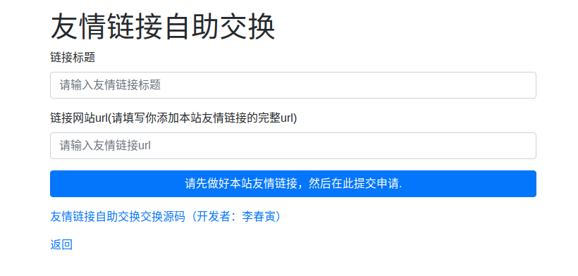

lichunyin/blogroll
=========================

lichunyin/blogroll 是一个php开发的友情链接自助申请模块。

对方通过 lichunyin/blogroll 提供的表单提交他的网站url与名称。lichunyin/blogroll内部会检查对方是否添加了我方的链接，并将对方的链接添加为我方的友情链接。

本模块代码中demo是本模块的使用实例，你可以在该目录下执行 php -S 127.0.0.1:8090 查看运行效果。

基本配置与说明
------------------------------------

::

    $options                    = [];
    $options['site_title']      = "demo";   // 我方网站标题
    $options['site_url']        = "http://licy.top"; // 我方网站url,对方需要将这个链接添加到他的友情链接列表
    $options['link_storage']    = new FileStorage(__DIR__ . DIRECTORY_SEPARATOR . 'link.storage.json'); // 友情链接存储信息的操作类。目前lichunyin/blogroll只提供了json格式的文件存储
    $config                     = new Config($options); // 配置信息设置类
    $link                       = new Link($config);    // 链接操作类，用来读取友情链接，或添加友情链接
    $pager                      = new Pager($link);     // pager类用户或者html页面相关的html内容

友情链接信息转换为html输出
------------------------------------

::

    <?php echo $pager->linksHtml();?>

友情链接申请表单
------------------------------------

::

    <?php echo $pager->bootstrapFrom();?>

